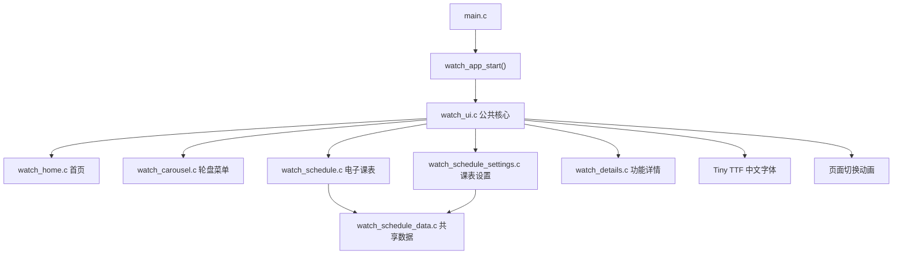

# 基于 LVGL 9.3 的智能手表 UI 界面项目详细技术文档

## 1. 文档说明

本文档用于说明当前智能手表 UI 项目的设计目标、软件架构、页面组成、交互逻辑、关键算法、字体资源、编译运行方法以及后续硬件移植方式。

项目当前运行于 Windows + SDL2 桌面模拟器，显示区域固定为 **240 × 280 像素**。界面面向长方形手表屏幕设计，页面内部可以使用圆形表盘、圆弧进度和圆角卡片等视觉元素。

本文档对应的主要工程目录为：

```text
D:\Study_Projects\32_Projects\LVGL\
└─ lv_pc_watch_vscode-release-v9.3
   └─ lv_port_pc_vscode-release-v9.3
```

## 2. 项目功能概览

当前项目实现了以下功能：

- 首页时间、日期和天气信息显示；
- 首页右滑循环切换极光、月夜和量子核心三套动态壁纸；
- 首页上滑循环切换玻璃数字、圆形刻度和科技指针三套表盘；
- 首页左滑进入卡片轮盘菜单；
- 卡片轮盘无限循环；
- 轮盘纵向拖拽、惯性滑动、缓动吸附；
- 鼠标滚轮或旋转表冠控制轮盘；
- 点击非中心卡片使其自动居中；
- 点击中心卡片打开对应功能页面；
- 普通详情页左右滑动返回轮盘菜单；
- 心率数据显示；
- 血氧数据显示；
- 环境温湿度显示；
- 步数、热量和距离显示；
- 姿态与平衡状态显示；
- 电子课表显示；
- 课表上下滚动；
- 课表左右切换日期；
- 点击课表顶部日期直接切换；
- 第1至18周下拉选择与日期自动换算；
- 学期起始日期设置；
- 每周每天最多五节课程的新增、修改和删除；
- 屏幕简易键盘与常用中文词组快捷输入；
- 课程数据本地保存并同步到电子课表；
- 音乐播放器界面；
- 设置界面；
- 全局深色、浅色主题切换；
- 首页下拉快捷面板使用太阳/月牙图形按钮切换主题，并与完整设置页同步；
- 首页下拉快捷面板使用纯电源图形按钮关闭屏幕；
- 中文 TTF 字体加载和内置字体回退；
- 页面淡入、淡出和缓动滑入动画。

## 3. 技术栈

| 项目           | 当前方案                           |
| -------------- | ---------------------------------- |
| 图形框架       | LVGL 9.3                           |
| 桌面显示驱动   | SDL2                               |
| 构建系统       | CMake                              |
| Windows 编译器 | MinGW GCC/G++                      |
| 编程语言       | C99，部分底层库使用 C++            |
| 中文字体       | Noto Sans SC 项目专用子集          |
| TTF 解码       | LVGL Tiny TTF                      |
| 图片文件系统   | LVGL STDIO 文件系统，驱动盘符 `A:` |
| 默认显示分辨率 | 240 × 280                          |
| 默认构建类型   | Debug                              |

## 4. 工程目录与模块划分

智能手表 UI 源代码位于：

```text
lvgl/demos/mylvgl/
```

当前模块结构如下：

```text
mylvgl/
├─ watch_app.c
├─ watch_app.h
├─ watch_ui.c
├─ watch_ui.h
├─ watch_home.c
├─ watch_home.h
├─ watch_carousel.c
├─ watch_carousel.h
├─ watch_schedule.c
├─ watch_schedule.h
├─ watch_schedule_data.c
├─ watch_schedule_data.h
├─ watch_schedule_settings.c
├─ watch_schedule_settings.h
├─ watch_details.c
└─ watch_details.h
```

### 4.1 `watch_app.c/.h`

智能手表应用的汇总入口。

对外只暴露一个启动 API：

```c
void watch_app_start(void);
```

主程序不直接了解首页、轮盘、课表或详情页面的内部实现，只调用该汇总接口。

### 4.2 `watch_ui.c/.h`

公共核心模块，负责：

- 页面根对象管理；
- 页面切换动画；
- 页面导航；
- 中文字体初始化；
- 深浅主题状态、运行时色板和分辨率定义；
- 标签、卡片、圆形按钮和圆弧控件的创建；
- 首页、轮盘、课表和详情模块的统一调度。

### 4.3 `watch_home.c/.h`

首页表盘模块，负责：

- 三套动态壁纸的创建和逐帧更新；
- 三种表盘样式的创建和切换；
- 时间与日期显示；
- 天气和温度显示；
- 每秒刷新时间；
- 左滑进入轮盘菜单；
- 右滑切换动态壁纸；
- 上滑切换表盘样式。

### 4.4 `watch_carousel.c/.h`

Cover Flow 卡片轮盘菜单模块，负责：

- 八个功能项目的数据定义；
- 五张主要可见卡片的曲线布局；
- 无限循环轮换；
- 纵向触摸拖拽；
- 惯性运动；
- 自动吸附；
- 点击选中；
- 表冠或鼠标滚轮控制；
- 横向手势返回首页；
- 卡片横滑点击锁和释放阶段快速手势复判；
- 静止状态管理和防抖。

### 4.5 `watch_schedule.c/.h`

电子课表模块，负责：

- 周一至周五的日期数据；
- 第1至18周、周一至周日的日期选择；
- 每天最多五节课程；
- 顶部日期选择器；
- 课程列表上下滚动；
- 左右滑动切换日期；
- 课程名称、上课时段、地点和颜色标识显示。

### 4.6 `watch_schedule_data.c/.h`

电子课表共享数据模块，负责：

- 学期起始日期存储；
- 18周 × 7天 × 5节课程的数据结构；
- 公历日期递增和跨月、跨年换算；
- 课程的新增、修改与删除；
- `watch_schedule.dat` 本地持久化。

### 4.7 `watch_schedule_settings.c/.h`

电子课表设置模块，负责：

- 学期起始日期选择；
- 周次和星期选择；
- 课程列表管理；
- 课程名称、上课时段和地点编辑；
- LVGL 屏幕键盘和中文快捷词组输入；
- 设置页、编辑页之间的返回手势。

### 4.8 `watch_details.c/.h`

其他功能详情模块，负责：

- 心率页面；
- 血氧页面；
- 环境温湿度页面；
- 步数页面；
- 姿态页面；
- 音乐页面；
- 设置页面；
- 普通详情页的左右滑动返回。

## 5. 软件架构



### 5.1 启动调用链

程序启动过程如下：

```text
main()
  ├─ lv_init()
  ├─ hal_init(240, 280)
  └─ watch_app_start()
       └─ watch_ui_init()
            ├─ 初始化中文字体
            ├─ 创建首页数据刷新定时器
            └─ watch_ui_show_home()
```

### 5.2 页面统一导航 API

公共模块提供以下导航接口：

```c
void watch_ui_show_home(void);
void watch_ui_show_carousel(void);
void watch_ui_show_detail(watch_app_t app);
void watch_ui_show_schedule_settings(void);
```

各页面模块不直接创建其他页面，而是调用公共导航 API。这样可以保证：

- 页面切换动画统一；
- 页面根对象销毁方式统一；
- 页面状态切换统一；
- 模块之间不会直接操作对方的私有变量。

## 6. 显示尺寸与坐标系统

主程序中的屏幕尺寸定义为：

```c
#define WATCH_LCD_WIDTH  240
#define WATCH_LCD_HEIGHT 280
```

公共模块中的视口尺寸为：

```c
#define WATCH_VIEWPORT_WIDTH  240
#define WATCH_VIEWPORT_HEIGHT 280
```

坐标原点位于屏幕左上角：

- X 轴向右增加；
- Y 轴向下增加；
- 屏幕中心约为 `(120, 140)`。

界面控件应优先使用上述公共尺寸宏，避免在模块中重复定义屏幕尺寸。

## 7. 页面和手势逻辑

| 当前页面       | 操作           | 结果                      |
| -------------- | -------------- | ------------------------- |
| 首页           | 左滑           | 进入轮盘菜单              |
| 首页           | 右滑           | 切换动态壁纸              |
| 首页           | 上滑           | 切换表盘样式              |
| 轮盘菜单       | 上下拖拽       | 旋转功能卡片              |
| 轮盘菜单       | 左右滑动       | 返回首页                  |
| 轮盘菜单       | 点击非中心卡片 | 卡片移动到中心            |
| 轮盘菜单       | 点击中心卡片   | 打开对应功能              |
| 普通详情页     | 左滑或右滑     | 返回轮盘菜单              |
| 普通详情页     | 点击左上角返回 | 返回轮盘菜单              |
| 课表页         | 上下滑动       | 滚动课程列表              |
| 课表页         | 左右滑动       | 切换日期                  |
| 课表页         | 点击顶部日期   | 选择对应日期              |
| 课表页         | 点击右上角周次 | 向下展开第1至18周选择列表 |
| 课表页         | 点击左上角返回 | 返回轮盘菜单              |
| 设置页         | 点击电子课表   | 进入课表管理              |
| 课表管理页     | 选择周次和星期 | 显示对应课程              |
| 课表管理页     | 点击添加课程   | 打开课程编辑页            |
| 课表管理页     | 点击已有课程   | 修改或删除课程            |
| 课表编辑页     | 点击输入字段   | 打开屏幕键盘              |
| 课表设置子页面 | 左滑或右滑     | 返回上一级                |

## 8. 页面切换动画

页面切换由 `watch_ui.c` 统一处理。

切换过程：

1. 保留旧页面根对象；
2. 创建新页面根对象；
3. 新页面从 X 轴偏移 16 像素的位置开始；
4. 新页面在 220 ms 内淡入；
5. 新页面在 230 ms 内缓动滑入到 X=0；
6. 旧页面在 170 ms 内淡出；
7. 旧页面在 240 ms 后删除。

这种处理方式避免了先删除旧页面再绘制新页面产生的黑屏闪烁。

## 9. 轮盘菜单技术说明

### 9.1 功能项目

当前轮盘包含八个功能：

1. 运动；
2. 心率；
3. 血氧；
4. 天气；
5. 音乐；
6. 姿态；
7. 课表；
8. 设置。

### 9.2 卡片布局

轮盘使用左侧圆心的 Cover Flow 视觉布局。

卡片离中心越远：

- 宽度越小；
- 高度越小；
- 透明度越低；
- X 坐标向左偏移；
- 与中心卡片形成弧形关系。

关键计算方式如下：

```text
卡片宽度 = 210 - 22 × 距离
卡片高度 = 70 - 12 × 距离
卡片 X   = 15 - 6 × 距离²
卡片 Y   = 140 + 相对槽位 × 52 - 卡片高度 / 2
透明度   = 255 - 76 × 距离
```

卡片只有在完全离开屏幕并且透明度为零后才隐藏，避免边缘卡片突然消失。

### 9.3 中心卡片判定

系统计算每张卡片中心点与屏幕中心点的二维距离，距离最小的卡片成为选中卡片。

为避免卡片在槽位边界反复切换，设置中心滞回区：

```c
#define WHEEL_CENTER_LOCK_SLOT 0.62f
```

只要当前卡片仍处于该中心区间，就保持当前选中项。

### 9.4 手势方向锁定

按下后累计移动距离。

当任一方向超过方向锁定阈值时确定本次手势方向：

- 纵向距离更大：控制轮盘；
- 横向距离更大且达到完整滑动阈值：返回首页；
- 方向确定后，本次手势不再切换方向。

释放时会再次根据起点和终点判断快速滑动，防止缺少 `PRESSING` 事件时漏判。只要本次操作曾被识别为拖动，就会锁住卡片点击；页面已经切换后，旧中心卡片产生的延迟 `CLICKED` 事件也会被忽略。这种方式可减少斜向滑动和中心卡片误点击。

### 9.5 惯性和吸附

拖动速度由输入设备的 Y 方向向量计算：

```text
轮盘速度 = Y 向量 × 0.018
```

惯性阶段每帧衰减：

```text
速度 = 速度 × 0.90
```

速度足够小时，轮盘吸附到最近卡片：

```text
当前位置 += 目标差值 × 0.22
```

当角度误差小于 `0.003` 时直接对齐目标位置。

### 9.6 静止防抖

轮盘模块使用 `wheel_motion_active` 标识轮盘是否仍在运动。

该状态只会在以下情况开启：

- 手势释放后仍有惯性；
- 点击非中心卡片；
- 开始自动吸附；
- 表冠或鼠标滚轮输入；
- 轮盘页面首次建立。

完成吸附后：

- 将角度精确设置为目标角度；
- 清零速度；
- 关闭吸附状态；
- 关闭运动状态；
- 停止卡片位置和层级重排。

定时器仍由 LVGL 管理，但静止时会立即返回，不再持续重绘，从而消除菜单静止时的抖动。

## 10. 首页技术说明

首页提供三套由 LVGL 控件实时绘制的动态壁纸：

- 极光：柔和光斑缓慢漂移、彩色圆弧旋转、星点闪烁；
- 月夜：月牙轻微浮动、轨道圆弧旋转、星点闪烁；
- 量子核心：深色科技背景、霓虹能量环、呼吸光核和彩色数据粒子。

壁纸动画由 40 ms 定时器更新，约为 25 FPS。离开首页时停止并释放定时器，避免隐藏页面持续刷新。

首页提供三种表盘样式：

- 半透明圆角玻璃数字表盘；
- 带刻度点和进度圆弧的圆形表盘；
- 科技指针表盘，包含 60 个刻度、时针、分针、秒针、霓虹中心轴和能量进度环。

三种表盘均显示：

- 当前时间；
- 当前日期；
- 星期；
- 天气；
- 温度。

时间通过 `lv_timer_create()` 创建的 1000 ms 定时器刷新。科技指针根据本地真实时间计算角度，上滑进入该表盘时自动匹配量子核心壁纸；右滑仍可独立循环切换三套动态壁纸。切换过程使用页面动画。

当前心率变化值是模拟数据预留，后续可连接真实传感器。

## 11. 电子课表技术说明

课表展示与设置共用 `watch_schedule_data.c` 中的唯一数据源。核心课程结构如下：

```c
typedef struct {
    bool active;
    char name[40];
    char time[24];
    char location[40];
    uint32_t color;
} watch_schedule_course_t;
```

完整数据容量为18周 × 7天 × 每天5节。课程保存后，电子课表页面重新进入或切换到对应周和日期时会直接读取最新内容。

### 11.1 日期换算

用户设置的日期表示“第一周周一”。任意课程日期的偏移量为：

```text
偏移天数 = (周次 - 1) × 7 + 星期索引
```

数据模块按公历逐日递增，支持大小月、闰年、跨月和跨年。顶部显示周一至周日，改变周次后七个日期与课程列表同时更新。

### 11.2 课程列表

课程列表的特点：

- 列表高度为 181 像素；
- 只允许纵向滚动；
- 自动显示细滚动条；
- 每张课程卡片显示课程名、上课时段和地点；
- 每张课程卡片高度为 62 像素；
- 课程卡片间距为 6 像素；
- 第五节课程可通过向上滑动查看。

课表页独立处理横向手势，因此左右滑动不会被普通详情页的返回逻辑截获。

### 11.3 课表设置与键盘

设置页新增“电子课表”入口。管理页提供学期开始日期、周次和星期选择，并列出对应课程。点击“添加课程”创建课程；点击已有课程可修改或删除。

编辑页包含课程名称、上课时段和地点三个字段。点击字段会打开 LVGL `lv_keyboard` 简易键盘，并在键盘上方提供常用中文词组快捷按钮。名称和地点最多输入12个字符，时段最多输入20个字符，以避免在小屏幕上溢出。

### 11.4 数据持久化

PC模拟器使用工程运行目录中的 `watch_schedule.dat` 保存课表，文件带有魔数和版本号。启动时校验文件；文件不存在或格式不匹配时自动生成演示数据。移植到单片机时，可将 `watch_schedule_data_save()` 替换为 Flash、LittleFS、FatFS 或 NVS 后端，上层页面无需修改。

## 12. 中文字体方案

### 12.1 字体文件

项目字体文件：

```text
assets/NotoSansSC-Watch.ttf
```

该字体是根据当前项目界面字符串生成的轻量子集，避免直接使用十几 MB 的完整中文字体。

### 12.2 字体加载

项目启用了：

```c
#define LV_USE_TINY_TTF 1
#define LV_TINY_TTF_FILE_SUPPORT 1
```

运行时加载：

```c
lv_tiny_ttf_create_file("A:assets/NotoSansSC-Watch.ttf", 16);
```

### 12.3 字体回退链

字体回退顺序：

```text
NotoSansSC-Watch.ttf
  ↓
Source Han Sans SC 16 内置子集
  ↓
SimSun 16 CJK 内置子集
  ↓
Montserrat 16
```

如果外部字体加载失败，界面仍可使用内置字体显示已有字符。

### 12.4 新增中文文字

如果后续增加了当前子集没有包含的汉字，需要重新生成字体子集，否则新字符可能显示为方框。

字体文件必须同时存在于：

```text
assets/NotoSansSC-Watch.ttf
bin/assets/NotoSansSC-Watch.ttf
```

CMake 重新配置时会把 `assets` 目录复制到 `bin`。

## 13. 公共界面控件

`watch_ui.c` 提供以下公共控件创建函数：

```c
lv_obj_t * watch_ui_make_label(...);
lv_obj_t * watch_ui_make_card(...);
lv_obj_t * watch_ui_round_button(...);
void watch_ui_add_arc(...);
void watch_ui_add_detail_header(...);
```

新增页面时应优先使用这些函数，以保持：

- 圆角统一；
- 边框统一；
- 文字对齐统一；
- 返回按钮统一；
- 颜色风格统一。

## 14. 深浅主题和公共颜色

主题类型定义为：

```c
WATCH_THEME_DARK
WATCH_THEME_LIGHT
```

完整设置页顶部的“外观模式”开关和首页下拉快捷面板底部的纯图形按钮均可切换主题。快捷按钮不显示文字：浅色模式显示白色简笔太阳，深色模式显示白色简笔月牙；旁边的关屏按钮仅显示顶部开口圆环和竖线组成的标准白色电源符号。两处主题控件读取和写入同一个全局状态，因此会始终保持同步。快捷面板切换主题时，首页使用无淡入、无滑动的即时刷新，快捷面板直接原位创建，不再次执行下拉动画。状态改变后，`watch_ui_set_theme()` 会使背景、卡片、文字、边框、键盘和动态图层同时使用同一套色板。

深色模式采用蓝黑背景、深海蓝卡片、青紫霓虹高光和接近白色的正文，适合夜间与科技表盘。浅色模式采用暖白背景、雾蓝卡片、深蓝灰正文、低饱和青色和珊瑚橙点缀，以避免纯白屏幕刺眼。

运行时公共颜色统一定义在 `watch_ui.h`：

```c
WATCH_COLOR_BG
WATCH_COLOR_SURFACE
WATCH_COLOR_SURFACE2
WATCH_COLOR_TEXT
WATCH_COLOR_MUTED
WATCH_COLOR_BORDER
WATCH_COLOR_CYAN
WATCH_COLOR_GREEN
WATCH_COLOR_RED
WATCH_COLOR_ORANGE
WATCH_COLOR_PURPLE
WATCH_COLOR_BLUE
WATCH_COLOR_DANGER_SURFACE
WATCH_COLOR_DANGER_TEXT
```

上述宏内部通过 `watch_ui_theme_pick()` 根据当前主题返回对应颜色。新增页面应优先使用公共颜色；特殊动态图层可调用 `watch_ui_theme_pick(dark, light)` 提供成对色值。

首页三套动态壁纸、三套表盘、轮盘菜单、快捷设置、健康详情、电子课表、课表管理和屏幕键盘均已分别适配深浅主题。轮盘卡片在两种模式下使用不同的低饱和度独立色板。

## 15. 编译和运行

### 15.1 环境要求

- Windows；
- CMake；
- MinGW GCC/G++；
- VS Code 或其他编辑器；
- SDL2，项目已包含对应运行库。

当前编译器路径示例：

```text
D:\DataApp\VScode\mingw64\bin\gcc.exe
D:\DataApp\VScode\mingw64\bin\g++.exe
```

### 15.2 配置工程

在 PowerShell 中进入：

```text
D:\Study_Projects\32_Projects\LVGL\
lv_pc_watch_vscode-release-v9.3\
lv_port_pc_vscode-release-v9.3
```

执行：

```powershell
& "C:\Program Files\CMake\bin\cmake.exe" `
  -S . `
  -B build `
  -G "MinGW Makefiles" `
  -DCMAKE_BUILD_TYPE=Debug `
  -DCMAKE_C_COMPILER="D:\DataApp\VScode\mingw64\bin\gcc.exe" `
  -DCMAKE_CXX_COMPILER="D:\DataApp\VScode\mingw64\bin\g++.exe"
```

### 15.3 编译

```powershell
& "C:\Program Files\CMake\bin\cmake.exe" `
  --build build `
  --target main `
  --parallel 2
```

生成文件：

```text
bin/main.exe
```

### 15.4 运行

可直接启动：

```powershell
.\bin\main.exe
```

也可使用 VS Code 中的 `Debug LVGL` 配置运行。

运行工作目录应设置为工程根目录，以便 `A:assets/...` 正确映射到资源文件。

## 16. CMake 缓存路径错误处理

如果工程目录移动过，可能出现：

```text
The current CMakeCache.txt directory is different than the directory
where CMakeCache.txt was created.
```

或者：

```text
The source does not match the source used to generate cache.
```

原因是 `build/CMakeCache.txt` 保存了旧工程的绝对路径。

解决方式：

1. 关闭正在运行的模拟器；
2. 删除当前工程内的 `build` 目录；
3. 在正确的工程路径重新执行 CMake 配置；
4. 重新编译。

删除前必须确认目标是当前工程的 `build` 生成目录，不能删除工程根目录。

## 17. 常见问题

### 17.1 中文显示为方框

检查：

- `LV_USE_TINY_TTF` 是否为 1；
- `LV_TINY_TTF_FILE_SUPPORT` 是否为 1；
- `assets/NotoSansSC-Watch.ttf` 是否存在；
- `bin/assets/NotoSansSC-Watch.ttf` 是否存在；
- 运行工作目录是否为工程根目录；
- 新增汉字是否已加入字体子集。

### 17.2 背景图片不显示

检查：

- `assets` 目录是否存在；
- CMake 是否重新配置并复制资源；
- LVGL STDIO 文件系统是否启用；
- 文件路径是否以 `A:` 开头；
- 程序工作目录是否正确。

### 17.3 轮盘静止时抖动

检查：

- 完成吸附后是否关闭 `wheel_motion_active`；
- 是否在静止状态持续调用 `wheel_render()`；
- 是否重复执行 `lv_obj_move_foreground()`；
- 中心滞回区是否被意外减小；
- 是否在多个模块重复创建轮盘运动定时器。

### 17.4 轮盘无法滑动

检查：

- 根对象是否设置为可点击；
- 是否注册 `PRESSED`、`PRESSING`、`RELEASED` 和 `PRESS_LOST`；
- 子卡片是否启用了事件冒泡；
- 输入设备是否已经绑定显示器；
- 手势移动距离是否超过 8 像素方向判定阈值。

### 17.5 左右滑动被误判为上下滑动

轮盘使用累计 X/Y 位移进行方向锁定。

如果需要调整，可修改：

```c
if(abs_dx < 8 && abs_dy < 8) return;
```

阈值过小容易误判，阈值过大会感觉响应迟钝。

### 17.6 编译时无法覆盖 `main.exe`

错误示例：

```text
cannot open output file ...\bin\main.exe: Permission denied
```

说明旧版模拟器仍在运行。关闭 `main.exe` 后重新编译即可。

## 18. 接入真实硬件

桌面模拟器切换到真实手表硬件时，需要替换以下部分。

### 18.1 显示驱动

当前：

```c
lv_sdl_window_create(240, 280);
```

硬件端需要：

- 注册真实 LCD 显示驱动；
- 设置刷新回调；
- 配置显存或局部刷新缓冲；
- 保持分辨率为 240 × 280；
- 根据 LCD 控制器选择 RGB565 等颜色格式。

### 18.2 触摸输入

当前使用 SDL 鼠标模拟触摸。

硬件端需要：

- 注册电容触摸控制器；
- 将触摸坐标映射到 240 × 280；
- 正确上报按下、移动和释放状态；
- 校准 X/Y 方向和屏幕旋转。

### 18.3 旋转表冠

当前使用 SDL 鼠标滚轮模拟。

硬件端可将编码器增量转换为 LVGL rotary diff，用于轮盘旋转。

### 18.4 系统时钟

当前通过标准 C `time()` 获取时间。

硬件端可替换为：

- RTC；
- 网络校时；
- 手机蓝牙同步时间。

### 18.5 传感器数据

当前页面为模拟数据。

建议增加独立数据层，例如：

```text
watch_sensor.c
watch_sensor.h
```

对外提供：

```c
uint8_t watch_sensor_get_heart_rate(void);
uint8_t watch_sensor_get_spo2(void);
float watch_sensor_get_temperature(void);
float watch_sensor_get_humidity(void);
uint32_t watch_sensor_get_steps(void);
```

界面模块只读取数据层，不直接操作 I²C、SPI 或传感器寄存器。

### 18.6 文件资源

如果硬件没有文件系统，可采用以下方案之一：

- 将字体转为 C 数组并使用 `lv_tiny_ttf_create_data()`；
- 将图片转为 LVGL C 数组；
- 使用 SPI Flash 文件系统；
- 使用 FatFS、LittleFS 或自定义资源分区。

## 19. 新增功能模块的方法

以新增“睡眠监测”为例：

1. 在 `watch_app_t` 中增加 `WATCH_APP_SLEEP`；
2. 在 `watch_carousel.c` 的轮盘项目数组增加睡眠卡片；
3. 新建：

```text
watch_sleep.c
watch_sleep.h
```

4. 在 `watch_ui.c` 的详情调度中调用睡眠模块；
5. 在 `CMakeLists.txt` 的模块源文件列表中加入 `watch_sleep.c`；
6. 如果新增中文文字，重新生成中文字体子集；
7. 重新配置并编译；
8. 检查轮盘循环、点击、返回和页面动画。

## 20. 编码规范建议

- 每个功能模块使用独立 `.c/.h`；
- `.h` 只暴露必要 API；
- 模块私有变量使用 `static`；
- 页面切换统一调用 `watch_ui_show_*()`；
- 不在功能模块中直接删除其他模块的对象；
- 公共颜色和尺寸使用 `watch_ui.h` 中的宏；
- 注释使用中文；
- 文件顶部说明模块职责；
- 复杂手势和算法必须写明阈值含义；
- 新增定时器前确认不会重复创建；
- 页面退出后及时清空可能指向已删除对象的指针；
- 修改字体、图片或 CMake 后重新执行配置；
- 编译前关闭正在运行的 `main.exe`。

## 21. 当前验证结果

当前版本已完成以下验证：

- CMake 配置成功；
- MinGW 编译成功；
- `bin/main.exe` 链接成功；
- 240 × 280 分辨率配置一致；
- 模块头文件和实现文件匹配；
- 主程序只调用 `watch_app_start()`；
- 原 `lv_demo_first.c/.h` 已被 `watch_app.c/.h` 替代；
- 页面导航 API 已集中到 `watch_ui.c`；
- 轮盘吸附完成后停止重绘；
- 课表支持五节课程和纵向滚动；
- 课表支持周一至周日、18周选择、日期点击和左右切换；
- 设置页支持学期起始日期、课程新增、修改和删除；
- 屏幕键盘支持英文、数字及常用中文词组快捷输入；
- 课程数据可保存到 `watch_schedule.dat` 并由课表页共享读取；
- 设置页支持全局深浅主题切换，各主要页面和键盘均已适配；
- 当前所有界面中文字符均已包含在字体资源中。

## 22. 关键文件索引

| 文件                                          | 说明                         |
| --------------------------------------------- | ---------------------------- |
| `main/src/main.c`                             | 模拟器主程序                 |
| `lvgl/demos/mylvgl/watch_app.c`               | 手表应用汇总入口             |
| `lvgl/demos/mylvgl/watch_app.h`               | 汇总 API                     |
| `lvgl/demos/mylvgl/watch_ui.c`                | 公共核心、导航与动画         |
| `lvgl/demos/mylvgl/watch_ui.h`                | 公共类型、颜色和控件 API     |
| `lvgl/demos/mylvgl/watch_home.c`              | 首页                         |
| `lvgl/demos/mylvgl/watch_carousel.c`          | 轮盘菜单                     |
| `lvgl/demos/mylvgl/watch_schedule.c`          | 电子课表                     |
| `lvgl/demos/mylvgl/watch_schedule_data.c`     | 课表数据、日期换算和持久化   |
| `lvgl/demos/mylvgl/watch_schedule_settings.c` | 课表设置、课程编辑和屏幕键盘 |
| `lvgl/demos/mylvgl/watch_details.c`           | 其他详情页面                 |
| `watch_schedule.dat`                          | 运行时课表数据文件           |
| `assets/NotoSansSC-Watch.ttf`                 | 项目中文字体                 |
| `assets/watch_bg_aurora.png`                  | 兼容保留的静态极光背景资源   |
| `assets/watch_bg_moon.png`                    | 兼容保留的静态月夜背景资源   |
| `lv_conf.h`                                   | LVGL 功能配置                |
| `CMakeLists.txt`                              | 工程构建配置                 |
| `bin/main.exe`                                | 桌面模拟器可执行文件         |

---

本文档基于当前工程代码生成。后续增加页面、修改手势阈值、变更硬件驱动或新增中文字符时，应同步更新本文档。
